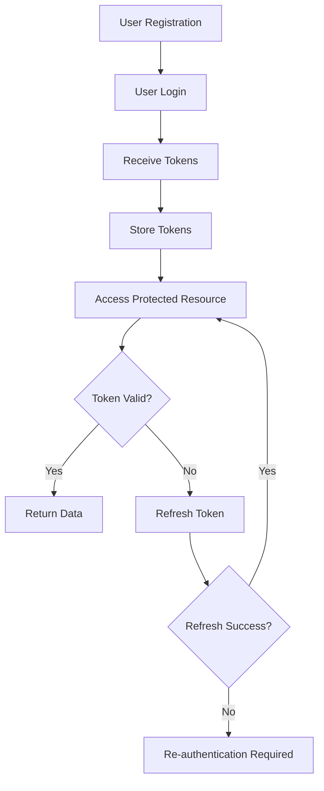

# Central Authentication Client

A FastAPI client application that integrates with the central authentication system at `https://auth-central-challange.vercel.app`. This application implements secure token management with automatic refresh capabilities.

## 🚀 Features

- **User Registration & Login**: Complete user authentication workflow
- **Automatic Token Refresh**: Handles access token expiration automatically
- **Token Management**: Secure storage and management of access and refresh tokens
- **Protected Endpoints**: Demonstrates secured API endpoints
- **Error Handling**: Comprehensive error handling for all authentication scenarios
- **Security Features**: Implements best practices for API security

## 📋 Requirements

- Python 3.8+
- FastAPI
- httpx
- pydantic
- uvicorn

## 🛠️ Installation

1. **Clone or download the project files**

2. **Install dependencies**:
```bash
pip install fastapi httpx pydantic[email] uvicorn python-multipart
```

3. **Run the application**:
```bash
python main.py
```

Or using uvicorn directly:
```bash
uvicorn main:app --host 0.0.0.0 --port 8000 --reload
```

4. **Access the application**:
   - API: http://localhost:8000
   - Interactive Docs: http://localhost:8000/docs
   - Alternative Docs: http://localhost:8000/redoc

## 🔧 How It Works

### Token Management System

The application implements a sophisticated token management system:

1. **Access Token**: Valid for 2 minutes
2. **Refresh Token**: Valid for 4 minutes
3. **Automatic Refresh**: Tokens are refreshed automatically when needed
4. **Buffer Time**: Access tokens are refreshed 30 seconds before expiration

### Authentication Flow



## 📊 API Endpoints

### Public Endpoints

- `GET /health` - Health check
- `POST /register` - Register new user
- `POST /login` - User login
- `GET /demo/test-flow` - Complete flow instructions

### Authentication Management

- `POST /logout` - Clear tokens
- `GET /token/status` - Check token status
- `POST /token/refresh` - Manually refresh token

### Protected Endpoints

- `GET /protected/data` - Get protected data (auto-refresh)
- `GET /protected/profile` - Get user profile (requires valid token)

## 🧪 Testing the Application

### 1. Register a User

```bash
curl -X POST "http://localhost:8000/register" \
  -H "Content-Type: application/json" \
  -d '{
    "username": "testuser",
    "email": "test@example.com",
    "password": "securepassword123",
    "full_name": "Test User"
  }'
```

### 2. Login

```bash
curl -X POST "http://localhost:8000/login" \
  -H "Content-Type: application/json" \
  -d '{
    "username": "testuser",
    "password": "securepassword123"
  }'
```

### 3. Check Token Status

```bash
curl -X GET "http://localhost:8000/token/status"
```

### 4. Access Protected Data

```bash
curl -X GET "http://localhost:8000/protected/data"
```

### 5. Test Token Refresh

Wait for 2+ minutes after login, then:

```bash
curl -X GET "http://localhost:8000/protected/data"
```

The application will automatically refresh the token and return the data.

## 🔒 Security Features

### Implemented Security Measures

1. **Token Expiration Handling**: Proper management of token lifecycles
2. **Automatic Refresh**: Seamless token refresh without user intervention
3. **Error Handling**: Comprehensive error responses for various scenarios
4. **Input Validation**: Pydantic models for request/response validation
5. **HTTP Security**: Proper HTTP status codes and headers
6. **Logging**: Detailed logging for monitoring and debugging

### Additional Security Considerations

- **HTTPS Only**: In production, ensure HTTPS is used
- **Token Storage**: Consider encrypting tokens at rest
- **Rate Limiting**: Implement rate limiting for authentication endpoints
- **CORS**: Configure CORS properly for web clients
- **Input Sanitization**: Additional validation for user inputs
- **Session Management**: Consider implementing session invalidation

## 🏗️ Architecture

### Core Components

1. **TokenManager**: Handles token storage and refresh logic
2. **AuthService**: Manages communication with central auth API
3. **FastAPI App**: Provides the REST API interface
4. **Security Dependencies**: Handles authentication middleware

### Key Classes

- `TokenManager`: Central token management with automatic refresh
- `AuthService`: Authentication operations with the central API
- `UserRegister/UserLogin`: Pydantic models for request validation
- `TokenResponse`: Standardized token response format

## 🐛 Error Handling

The application handles various error scenarios:

- **Network Errors**: Service unavailable responses
- **Invalid Credentials**: Proper 401 responses
- **Expired Tokens**: Automatic refresh attempts
- **Refresh Failures**: Clear error messages
- **Service Downtime**: Graceful degradation

## 📝 Logging

Comprehensive logging is implemented:

- **Info Level**: Normal operations and token refresh
- **Error Level**: Authentication failures and network errors
- **Debug Level**: Detailed token management operations

## 🚀 Deployment Considerations

### Production Checklist

- [ ] Use environment variables for configuration
- [ ] Implement proper secret management
- [ ] Add rate limiting
- [ ] Configure HTTPS
- [ ] Set up monitoring and alerting
- [ ] Implement database for persistent sessions
- [ ] Add health checks for dependencies

### Environment Variables

```bash
AUTH_BASE_URL=https://auth-central-challange.vercel.app
ACCESS_TOKEN_EXPIRE_MINUTES=2
REFRESH_TOKEN_EXPIRE_MINUTES=4
LOG_LEVEL=INFO
```

## 🔄 Token Refresh Mechanism

The application implements a sophisticated token refresh system:

1. **Proactive Refresh**: Tokens are refreshed before expiration
2. **Automatic Recovery**: Failed requests trigger refresh attempts
3. **Fallback Handling**: Clear error messages when refresh fails
4. **Thread Safety**: Safe for concurrent requests

## 📈 Monitoring

Key metrics to monitor in production:

- Token refresh success rate
- Authentication failure rate
- API response times
- Error rate by endpoint
- Token expiration events

## 🤝 Contributing

1. Follow the existing code style
2. Add comprehensive error handling
3. Include logging for debugging
4. Write clear documentation
5. Test all authentication flows

## 📚 Additional Resources

- [FastAPI Documentation](https://fastapi.tiangolo.com/)
- [OAuth 2.0 and OpenID Connect](https://oauth.net/2/)
- [JWT Best Practices](https://auth0.com/blog/a-look-at-the-latest-draft-for-jwt-bcp/)
- [API Security Best Practices](https://owasp.org/www-project-api-security/)

## 📄 License

If you have any questions, feel free to open an issue on GitHub or contact ME.

---

**Note**: This application is designed to work with the central authentication system at `https://auth-central-challange.vercel.app`. Make sure the central service is running before testing the application.
